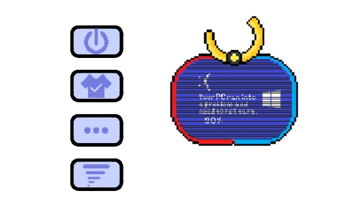

# Welcome to Carrier Desktop!

Carrier 是一款智能桌面宠物, 通过将Ai组件嵌入程序, 实现与用户的交互, 你可以通过独有的面板进行交互, 也可以通过语音进行交互, 模块开支持程序嵌入, 你可以将电脑程序嵌入程序, 让 Carrier 助你启动, Ai为千万产品赋能

## 运行配置

你需要对 Clion 进行QT配置, 然后运行 CMake, 添加QT模块运行程序, 也可以下载Release下的安装包进行运行

## 运行效果展示

基础展示

工具箱展示

换装功能展示

